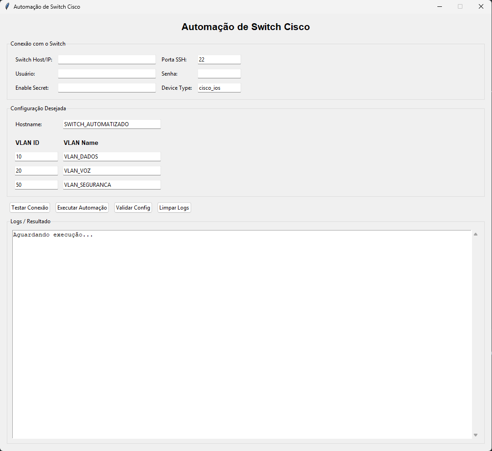
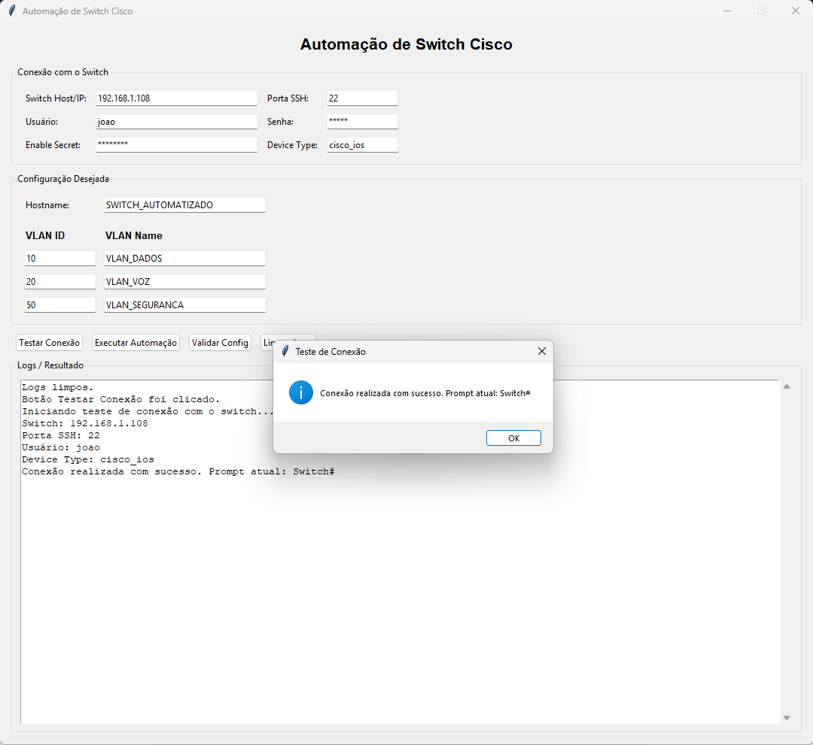
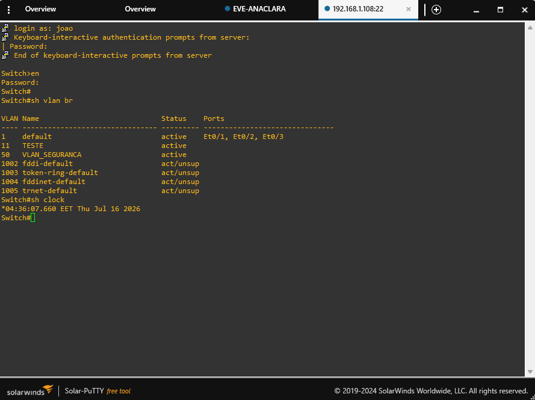
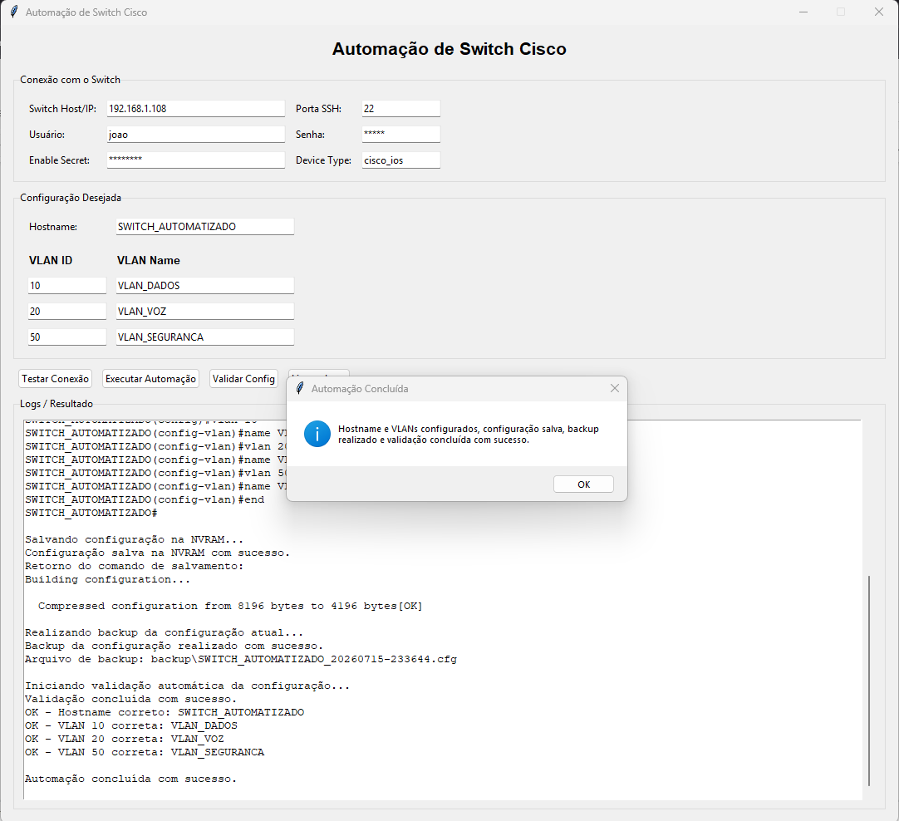
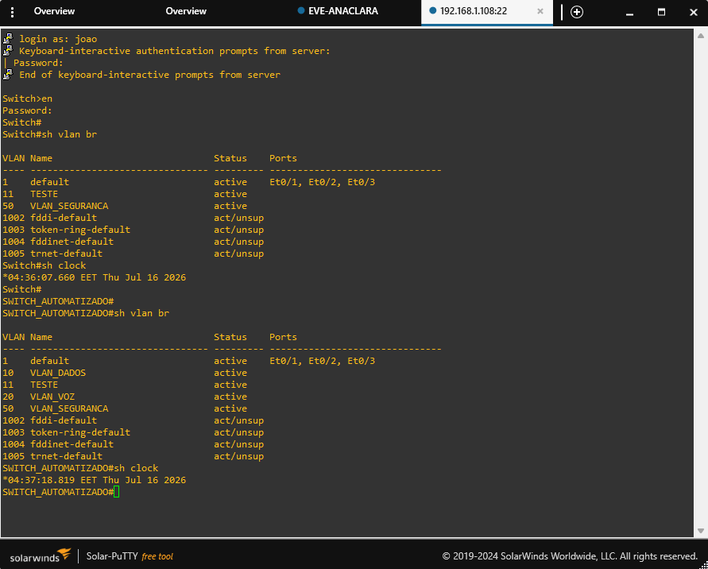
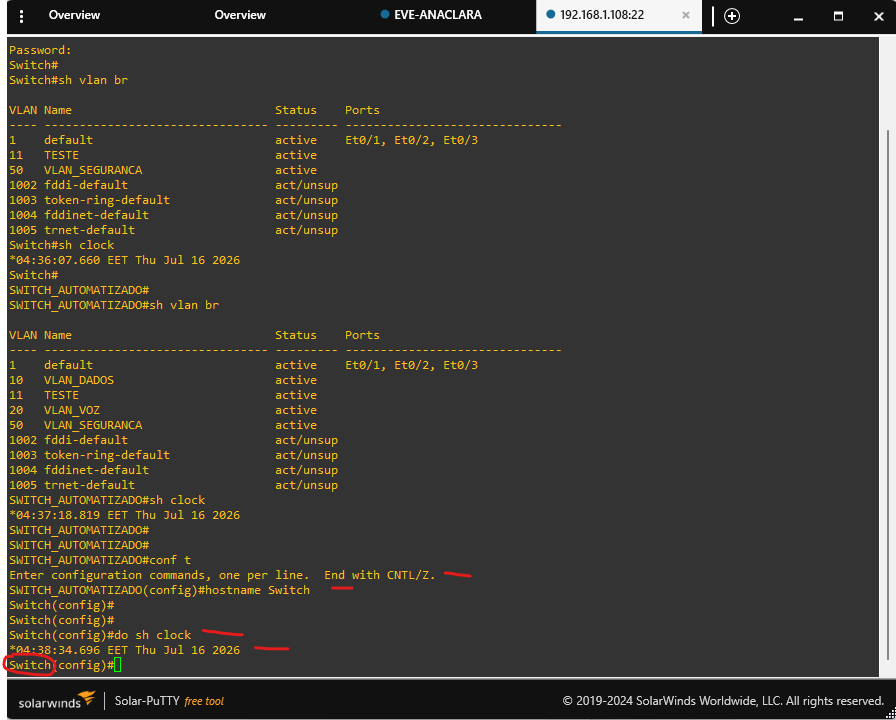
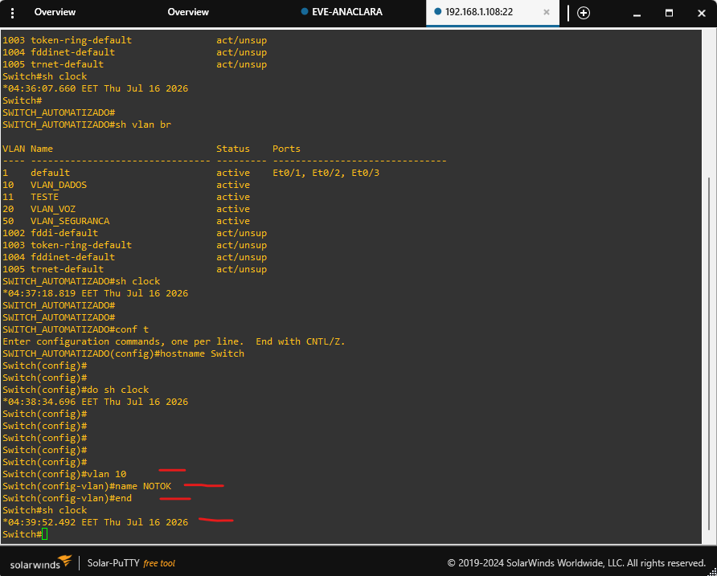
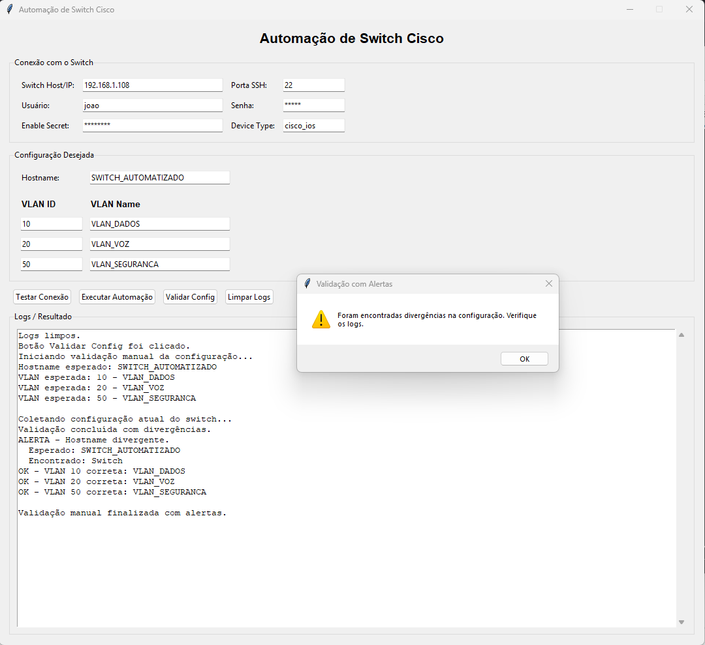
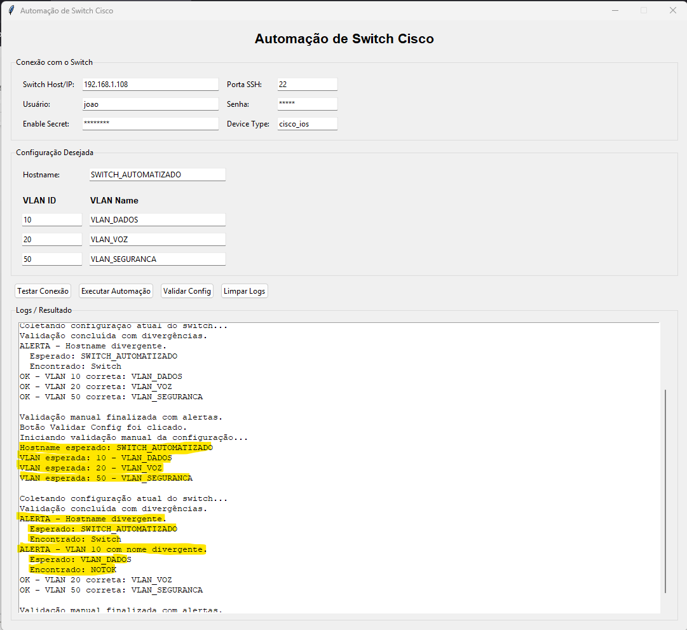
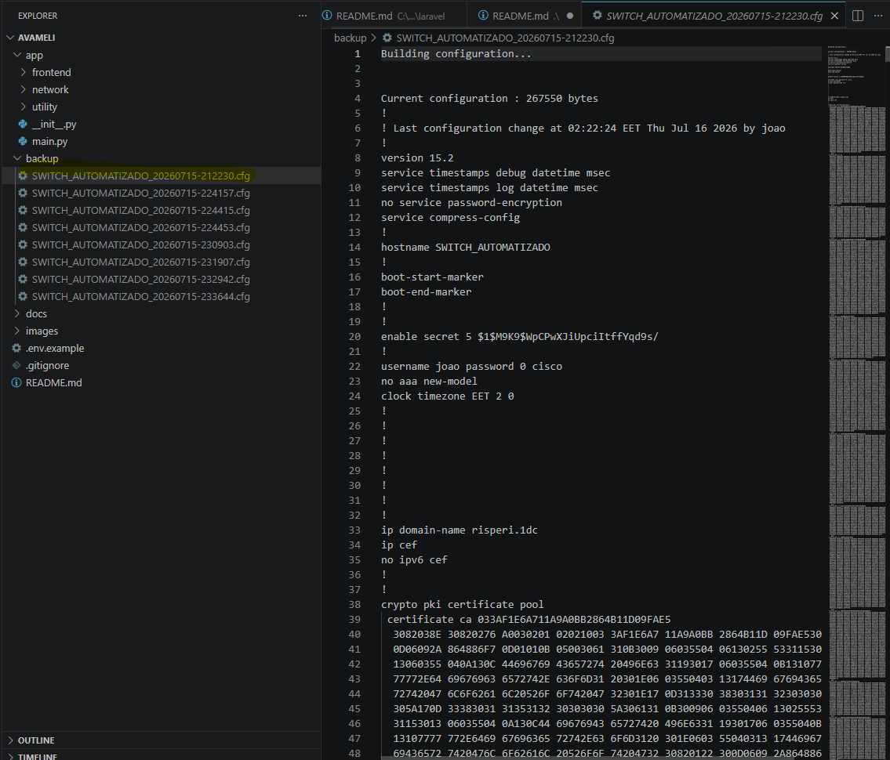

# Switch Automation - Avaliação


## Objetivo

Este projeto foi desenvolvido como parte de uma avaliação técnica destinada a validar conhecimentos em **Automação de Redes (Network Automation)**. O desafio original em formato PDF **não será disponibilizado neste repositório**, a fim de preservar a confidencialidade das informações. Essa avaliação tem por objetivo automatizar:

- Configuração de hostname
- Configuração de VLANs
- Realizar 'write memory'
- Backup local da configuração
- Validação da configuração aplicada
- Versionamento 


## Funcionalidades

- Interface gráfica simples com Tkinter
- Teste de conexão SSH com o equipamento
- Configuração de hostname
- VLAN ID e VLAN Name inserido pelo usuário
- write memory
- Backup local da configuração atual
- Validação automática após a automação
- Validação manual sem push de configuração
- Exibição de logs e alertas com clear logs


## Tecnologias utilizadas

- **Python**
- **Tkinter**
- **Netmiko**
- **Git**


## Pré-requisitos

1. [Download](https://www.python.org/downloads/) e instalação do Python

    1.1 Já com o Python instalado, é necessário o download do Netmiko para prosseguir.

    ```bash
    pip3 install netmiko
    ```


2. [Criar](https://github.com/) uma conta no Github
3. [Download](https://git-scm.com/install/windows) e instalação do Git
4. Acesso SSH ao equipamento
5. Usuário com permissão de conf t

## GIT

Com o Git instalado em sua máquina, escolha o diretório onde deseja armazenar o projeto. Em seguida, acesse o repositório no GitHub, copie a URL de clonagem e execute o comando git clone para baixar uma cópia do repositório para o seu ambiente local, conforme ilustrado abaixo.


**Comandos úteis:**

    git status
    git add .
    git commit -m "A pretty little message"
    git push
    git pull

## Como usar

### Executar automação

Iniciar o arquivo **app/main.py** - Responsável por iniciar a interface gráfica Tkinter.



A aplicação possui os seguintes campos:

- Conexão com o switch
    - Switch Host/IP: endereço IP ou hostname do switch
    - Porta SSH: porta SSH, normalmente 22
    - Usuário: usuário de acesso ao switch
    - Senha: senha do usuário
    - Enable Secret: senha de enable, se aplicável
    - Device Type: tipo do dispositivo no Netmiko, por padrão cisco_ios
- Configuração desejada
    - Hostname: hostname desejado para o switch
    - VLAN ID: identificador da VLAN
    - VLAN Name: nome da VLAN

- Valores padrão utilizados:

```cisco 
Hostname: SWITCH_AUTOMATIZADO
VLAN 10: VLAN_DADOS
VLAN 20: VLAN_VOZ
VLAN 50: VLAN_SEGURANCA
```

### Botões

#### **Testar Conexão**
Valida os campos obrigatórios e realiza um teste de conexão SSH com o switch. O teste utiliza Netmiko para conectar ao equipamento e executar um comando simples de verificação.



#### **Executar Automação**

Executa o fluxo completo de automação:

1. Valida os campos preenchidos
2. Gera os comandos de configuração
3. Conecta ao switch via SSH
4. Aplica hostname e VLANs
5. Salva a configuração na NVRAM
6. Realiza backup local da running-config
7. Valida a configuração final
8. Exibe o resultado na interface

Antes

Execução do job

Após



#### **Validar Config**
Executa apenas a validação da configuração atual do switch. Este botão é útil para testar divergências sem reaplicar a configuração.

**Exemplo de uso:** Configure o switch usando o botão Executar Automação, altere na interface o nome esperado de uma VLAN e clique em Validar Config. A aplicação exibirá alerta informando a divergência encontrada






Ao executar a automação para executar as mudanças e verificar novamente, é esperado:


#### Limpar Logs
Limpa a área de logs da interface gráfica.

### Backup 

Após a automação, a aplicação realiza backup da configuração atual do switch localmente na pasta backup/
O nome do arquivo segue o padrão:
```
HOSTNAME_YYYYMMDD-HHMMSS.cfg
```

Exemplo:



**Os arquivos de backup não são enviados para o Git, pois podem conter informações sensíveis da configuração do equipamento.**


### Versionamento
O projeto é gerenciado com Git. Durante o desenvolvimento, foram realizados commits descritivos para registrar a evolução do projeto.

O projeto utiliza .gitignore para evitar o versionamento de arquivos temporários, sensíveis ou gerados automaticamente, como .env, venv/ ou __pycache__/.

A pasta backup/ é mantida no repositório por meio de um arquivo .gitkeep, mas os arquivos reais de backup são ignorados.

## Considerações finais

Esses sete dias foram uma experiência extremamente enriquecedora. Saí da minha zona de conforto como engenheiro de redes para desenvolver habilidades em automação, programação e versionamento de código. Foi um desafio intenso, mas que mostrou na prática que o futuro da engenharia de redes já faz parte do presente (e é onde quero estar, inclusive).
