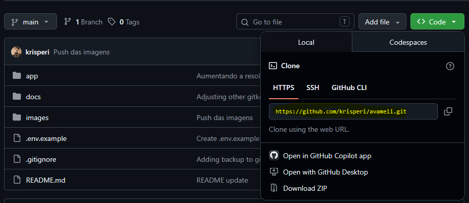
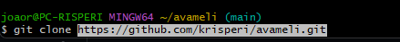

# Switch Automation - Avaliação

___

## Objetivo

Este projeto foi desenvolvido como parte de uma avaliação técnica destinada a validar conhecimentos em **Automação de Redes (Network Automation)**. O desafio original em formato PDF e **não será disponibilizado neste repositório**, a fim de preservar a confidencialidade das informações. Essa avaliação tem por objetivo automatizar:

- Configuração de hostname
- Configuração de VLANs
- Realizar 'write memory'
- Backup local da configuração
- Validação da configuração aplicada
- Versionamento 


Esses sete dias foram uma experiência extremamente enriquecedora. Saí da minha zona de conforto como engenheiro de redes para desenvolver habilidades em automação, programação e versionamento de código. Foi um desafio intenso, mas que mostrou na prática que o futuro da engenharia de redes já faz parte do presente (e é onde quero estar, inclusive).
___

## Tecnologias utilizadas

- **Python**
- **Tkinter**
- **Netmiko**
- **Git**

___

## Pré-requisitos

1. [Download](https://www.python.org/downloads/) e instalação do Python

    1.1 Já com o Python instalado, é necessário o download do Netmiko para prosseguir.

    ```bash
    pip3 install netmiko
    ```


2. [Criar](https://github.com/) uma conta no Github
3. [Download](https://git-scm.com/install/windows) e instalação do Git
4. Acesso SSH ao equipamento
5. Usuário com permissão de conf t
___

## GIT

Com o Git instalado em sua máquina, escolha o diretório onde deseja armazenar o projeto. Em seguida, acesse o repositório no GitHub, copie a URL de clonagem e execute o comando git clone para baixar uma cópia do repositório para o seu ambiente local, conforme ilustrado abaixo.





##### Comandos úteis:
    ```bash
    git status
    git add .
    git commit -m "A pretty little message"
    git push
    git pull
    ```

## Funcionalidades

- Interface gráfica simples com Tkinter
- Teste de conexão SSH com o equipamento
- Configuração de hostname
- VLAN ID e VLAN Name inserido pelo usuário
- write memory
- Backup local da configuração atual
- Validação automática após a automação
- Validação manual sem push de configuração
- Exibição de logs e alertas com clear logs

