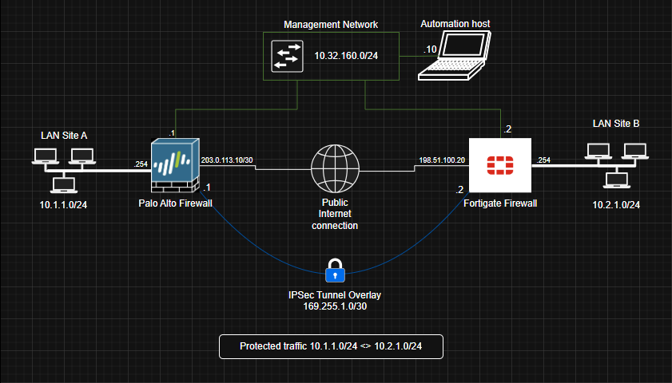

# Plano de Automação de VPN IPSec entre FortiGate e Palo Alto

## Resumo

Seguindo para a parte 2 do desafio - esse documento descreve um plano para automatizar a configuração de uma VPN IPSec site-to-site entre os firewalls FortiGate e Palo Alto.

O objetivo é definir os parâmetros necessários, ferramentas, passos lógicos da automação, considerações específicas de ambiente multi-vendor e estratégias de validação e alertas.

A automação proposta considera o uso de Python com entrada de dados em JSON e módulos específicos para cada fabricante, permitindo que a mesma estrutura de dados gere configurações compatíveis com FortiGate e Palo Alto.

Para essa solução, a execução escolhida é via CLI por ser simples, direta e adequada para um ambiente de laboratório. Como o foco em planejamento e na lógica da automação, uma interface gráfica não é necessária. O modo CLI permitirá que o engenheiro acompanhe cada etapa da execução em tempo real.


## Cenário proposto

O cenário proposto contempla uma VPN IPSec site-to-site entre dois ambientes:




### Informações gerais
| **Item** | **Site A** | **Site B** |
|---|---|---|
| **Fabricante** | Palo Alto | Fortinet |
| **Função** | Firewall | Firewall |
| **Tipo de VPN** | IPSec Site-to-site | IPSec Site-to-site |
| **Autenticação** | Pre-shared key | Pre-shared key |
| **IKE Version** | IKEv2 | IKEv2 |


### Endereçamento

| Endereço | Palo Alto | Fortigate |
|---|---:|---:|
| IP WAN | `203.0.113.10` | `198.51.100.20` |
| IP de gerenciamento | `10.32.160.1` | `10.32.160.2` |
| Rede local | `10.1.1.0/24` | `10.2.1.0/24` |
| Interface WAN | `TBD` | `TBD` |
| Interface LAN/Trust | `TBD` | `TBD` |
| Nome do túnel | `IPSEC-TU1` | `IPSEC-TU1` |


```
- Por se tratar de um ambiente de laboratório virtual não-produtivo, os IPs de WAN escolhidos são correspondentes a faixa TEST-NET da IANA usada para fins de documentação.

- Os ranges de gerência e rede local são fictícios para teste do laboratório

- Nome lógico do túnel IPSec foi o mesmo utilizado em ambos os firewalls para facilitar identificação operacional e troubleshooting.
```
---

### VPN e definição de parâmetros

Uma VPN é necessária quando precisamos de uma comunicação segura entre ambientes que estão interligados por uma infraestrutura não confiável, como por exemplo, a internet. Evitando expor diretamente os serviços internos, a VPN cria um caminho protegido entre os ambientes, permitindo que tráfego sensível seja transportado com segurança.

Para que seja estabelecida uma VPN IPSec, faz necessário o uso dos princípios **C.I.A** de segunça: **Confidencialidade, Integridade e Autenticação**, divido em 2 fases.

- Confidencialidade é garantida pela criptografia, como AES, protegendo os dados contra leitura indevida.
- Integridade é garantida por algoritmos como SHA, que ajudam a detectar alterações no tráfego.
- Autenticação é estabelecida durante a negociação entre os peers, normalmente com pre-shared key ou certificados.

1. Na Phase 1, os dispositivos estabelecem um canal seguro de controle usando IKE, negociando autenticação, criptografia, integridade e grupo Diffie-Hellman.

2. Na Phase 2, os peers negociam os parâmetros IPSec usados para proteger o tráfego real entre as redes, incluindo criptografia, integridade, PFS, lifetime e os seletores de tráfego ou Proxy IDs.

Abaixo há os protocolos escolhidos de exemplo para nosso laboratório: 

### Phase 1 - IKE

| Parâmetro | Valor |
|---|---|
| IKE Version | IKEv2 |
| Autenticação | Pre-shared Key |
| Criptografia | AES-256 |
| Integridade | SHA-256 |
| Diffie-Hellman Group | Group 14 |
| Lifetime | 28800 segundos |

### Phase 2 - IPSec

| Parâmetro | Valor |
|---|---|
| Criptografia | AES-256 |
| Integridade | SHA-256 |
| PFS | Habilitado |
| PFS Group | Group 14 |
| Lifetime | 3600 segundos |
| Tráfego protegido | `10.1.1.0/24` <> `10.2.1.0/24` |

### Compatibilidade

Os parâmetros AES-256 e SHA-256 foram escolhidos por serem amplamente utilizados, seguros e compatíveis entre FortiGate e Palo Alto. O Diffie-Hellman Group 14 e o PFS Group 14 foram selecionados por oferecerem um bom equilíbrio entre segurança e compatibilidade.

Grupos como 15 podem oferecer mais criptografia, porém podem gerar maior utilização de recursos em ambientes escalados e de hardware mais antigo/limitado. Já grupos como 19 ou 20, são modernos e eficientes, mas podem apresentar limitações de compatibilidade dependendo da versão do FortiOS ou PAN-OS.


## Ferramentas e APIs

A automação de configuração de VPN IPSec entre FortiGate e Palo Alto pode ser realizada por diferentes métodos a depender do ambiente, das regras de negócio, do nível de padronização desejado e das ferramentas já implementadas pela engenharia e arquitetura.

### Palo Alto

| Dispositivo | Ferramenta/API | Uso possível |
|---|---|---|
| Palo Alto | Palo Alto REST API | Criar objetos, interfaces, VPN, rotas e policies |
| Palo Alto | Palo Alto XML API | Configuração, comandos operacionais e commit via API call |
| Palo Alto | SSH/CLI Python com Netmiko | Enviar comandos `set`, executar commit e coletar validações |
| Palo Alto | Panorama | Gerenciamento centralizado e GUI |


### Fortinet

| Dispositivo | Ferramenta/API | Uso possível |
|---|---|---|
| FortiGate | FortiGate REST API | Criar objetos, VPN IPSec, rotas, policies e consultar status via API calls |
| FortiGate | SSH/CLI Python com Netmiko | Enviar comandos CLI e coletar validações |
| FortiGate | FortiManager | Gerenciamento centralizado e GUI |


Para esse exemplo, a abordagem escolhida será Python com entrada estruturada e Netmiko via SSH. Essa opção é simples para laboratório e permite demonstrar a lógica multi-vendor, chamando módulos diferentes conforme o fabricante identificado. 

**OBS:** Para produção, APIs oficiais, FortiManager ou Panorama seriam opções mais robustas e confiáveis.


## Considerações específicas entre FortiGate e Palo Alto

Automatizar a configuração de uma VPN IPSec entre dispositivos de fabricantes diferentes exige atenção nas diferenças de implementação, nomenclatura, sintaxe, comportamento operacional e métodos de validação. Mesmo quando os parâmetros criptográficos são compatíveis, cada plataforma possui formas próprias de configurar objetos, túneis, rotas, políticas e commits.


| Pontos de divergência | Comentários |
|---|---|
| Sintaxe de configuração | Cada vendor possui sua própria "linguagem" para escrever linhas de configuração e comandos de validação. |
| Aplicar configuração | No FortiGate, muitas alterações são aplicadas ao finalizar o bloco de configuração. No Palo Alto, as alterações ficam em candidate configuration e precisam de um `commit` para entrar em produção. |
| Nomenclatura dos algoritmos | Os mesmos algoritmos podem ter nomes diferentes entre vendors. Por exemplo, AES-256, SHA-256 e DH Group 14 podem exigir formatos específicos em cada plataforma. |
| Interface túnel | Em VPN route-based, cada vendor trata a interface de túnel de forma diferente. O FortiGate usa uma interface associada à Phase 1, enquanto o Palo Alto utiliza tunnel interfaces como tunnel.x. |
| Políticas de firewall | Além da VPN, é necessário criar políticas permitindo o tráfego entre as redes protegidas. No FortiGate, as políticas são baseadas em interfaces. No Palo Alto, as políticas são baseadas em zonas. |
| Commit e rollback | Palo Alto exige commit e possui candidate configuration. FortiGate tem comportamento diferente de aplicação. O plano de rollback deve considerar essas diferenças para evitar mudanças parciais ou inconsistentes. |


## Fluxo de automação

### Separação por vendor

Para manter o código organizado, a automação deve separar as entradas informadas de acordo com o campo ***vendor***  para que os comandos aplicados sejam corretamente de acordo com o OS desejado.

Após essa separação, há um módulo ***parameters.py*** que fará a padronização dos parâmetros criptográficos informados para que esteja de acordo também com o OS a ser configurado.

### Fluxo lógico proposto

1. **Ler o arquivo de entrada**
   - Carregar os parâmetros da VPN a partir de um arquivo JSON.
   - O arquivo deve conter informações como vendor, IP de gerenciamento, peer IP, rede local, rede de interface túnel, zonas e parâmetros de Phase 1 e Phase 2.

2. **Validar os parâmetros obrigatórios**
   - Verificar se os campos necessários foram preenchidos.
   - Validar se os vendors informados são suportados.
   - Validar se os parâmetros de Phase 1 e Phase 2 são compatíveis entre as duas extremidades.

3. **Normalizar os parâmetros por vendor**
   - Converter valores genéricos do arquivo de entrada para a sintaxe esperada por cada plataforma.

4. **Executar pré-checks de conectividade**
   - Testar conectividade com os IPs de gerenciamento.
   - Conectar aos firewalls via SSH
   - Testar ping para o endereço de WAN do peer

5. **Gerar configuração para o FortiGate**
   - Criar objetos de endereço para rede local e rede remota.
   - Configurar Phase 1 com IKEv2, PSK, AES-256, SHA-256 e DH Group 14.
   - Configurar Phase 2 com AES-256, SHA-256 e PFS Group 14.
   - Criar ou associar a interface de túnel `IPSEC-TU1`.
   - Configurar rota estática para a rede remota via túnel.
   - Criar políticas de firewall permitindo tráfego entre LAN e VPN.

6. **Gerar configuração para o Palo Alto**
   - Criar address objects para rede local e rede remota.
   - Criar IKE Crypto Profile com os parâmetros de Phase 1.
   - Criar IPSec Crypto Profile com os parâmetros de Phase 2.
   - Criar IKE Gateway apontando para o peer FortiGate.
   - Criar tunnel interface com o IP definido para o Palo Alto.
   - Criar IPSec Tunnel associado ao IKE Gateway e ao IPSec Crypto Profile.
   - Configurar rota estática para a rede remota via tunnel interface.
   - Criar security policies permitindo o tráfego entre as zonas envolvidas.
   - Executar commit para aplicar a configuração.

7. **Aplicar configuração nos firewalls**
   - O script deverá identificar o vendor de cada equipamento e chamar o módulo correto (fortigate.py ou palo-alto.py).

8. **Executar validação após automação**
   - Verificar se a Phase 1 foi estabelecida de acordo com os comandos disponíveis de cada vendor
   - Verificar se a Phase 2 foi estabelecida de acordo com os comandos disponíveis de cada vendor
   - Ping para o IP do túnel vizinho
   - Validar rotas, políticas de firewall e interfaces de túnel.
   - Exibir o resultado no terminal.


