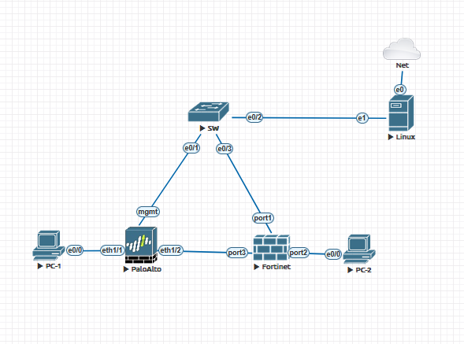
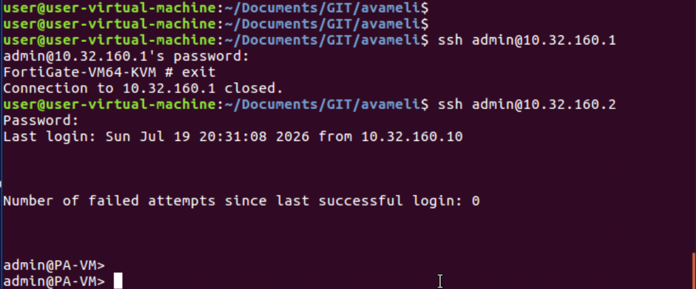

# LAB Opcional
## Considerações pessoais

Para a execução deste laboratório, foi necessário uma aquisição de um plano EVE-NG Cloud, já que rodar as máquinas virtuais do FortiGate, Palo Alto e Ubuntu simultaneamente ultrapassava os limites de hardware da minha máquina. Apesar disso, consegui emular o ambiente o cenário proposto, aproximando a topologia ao máximo de um cenário real.

O código dessa automação se encontra em [app](/app/)



No desenvolvimento da automação, optei por implementar uma interface em linha de comando (CLI). Considerei que o tempo seria mais bem aproveitado focando na documentação, no planejamento e nos testes — etapas que, a meu ver, são as mais críticas desta avaliação.

Por fim, mesmo recorrendo a documentações, pesquisas e ferramentas de IA, priorizei entregar uma solução cujo funcionamento eu compreendesse, em vez de apresentar um produto visualmente legal, mas que estivesse além do conhecimento que consegui consolidar no prazo do desafio.

# Implementação do laboratório

Após a montagem da infraestrutura virtual, foram realizadas as seguintes etapas para preparação do ambiente:

1. Configuração do Ubuntu 24.04

O Ubuntu foi utilizado como estação responsável pela execução da automação já que estou emulando na nuvem.

As atividades realizadas foram:

- Configuração da interface de ens4 com o endereço 10.32.160.10/24;
- Instalação do Git;
- Instalação do Python 3;
- Clonagem do repositório utilizando git pull, permitindo acesso aos códigos do projeto.

```bash
sudo ip addr add 10.32.160.10/24 dev ens4
sudo apt update
sudo apt install python3
sudo apt install git -y
```

2. Configuração do Palo Alto

Inicialmente foi necessário configurar a interface de gerenciamento para utilizar endereço IP estático e habilitar o acesso remoto via SSH.

```
delete deviceconfig system type dhcp-client
set deviceconfig system type static
commit
```

Configuração dos parâmetros de gerenciamento:

```
configure
set deviceconfig system ip-address 10.32.160.2
set deviceconfig system netmask 255.255.255.0
set deviceconfig system default-gateway 10.32.160.10
set deviceconfig system dns-setting servers primary 8.8.8.8
commit
```

Criação/configuração do usuário utilizado pela automação:

```bash
set mgt-config users risperi password
```


3. Configuração do FortiGate

No FortiGate, o primeiro passo foi remover a configuração de DHCP da interface de gerenciamento, definir um endereço IP estático e habilitar os serviços necessários para administração remota.

```bash
config system interface
edit port1
set mode static
set ip 10.32.160.1 255.255.255.0
set allowaccess ping ssh
end
```

Em seguida, foi configurado o mesmo usuário utilizado no Palo Alto. A escolha teve como objetivo simplificar a autenticação durante o desenvolvimento e validação do laboratório. Em um ambiente de produção, o ideal seria utilizar RADIUS ou TACACS, além de credenciais específicas para as automações.

```bash
config system admin
edit admin
set password <senha>
end
```

Após a conclusão dessas configurações, foi realizada a validação do acesso SSH tanto ao FortiGate quanto ao Palo Alto, confirmando que ambos estavam aptos para serem utilizados pela automação desenvolvida.



