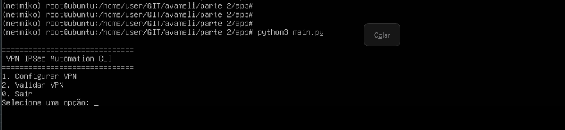
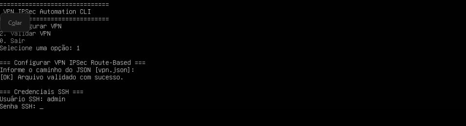
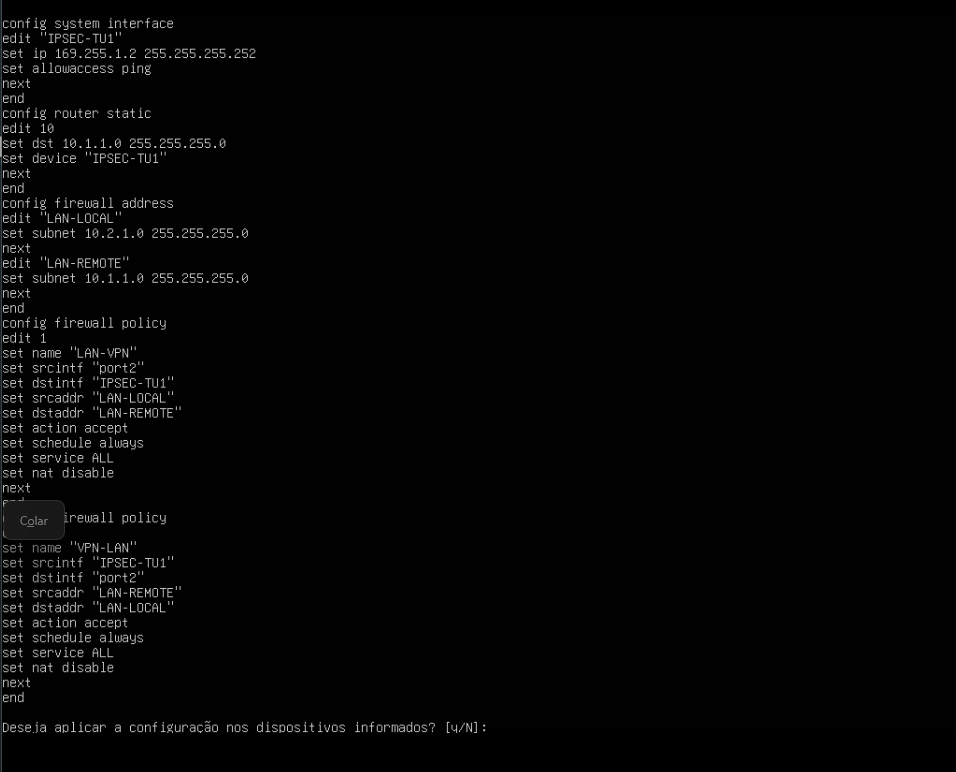
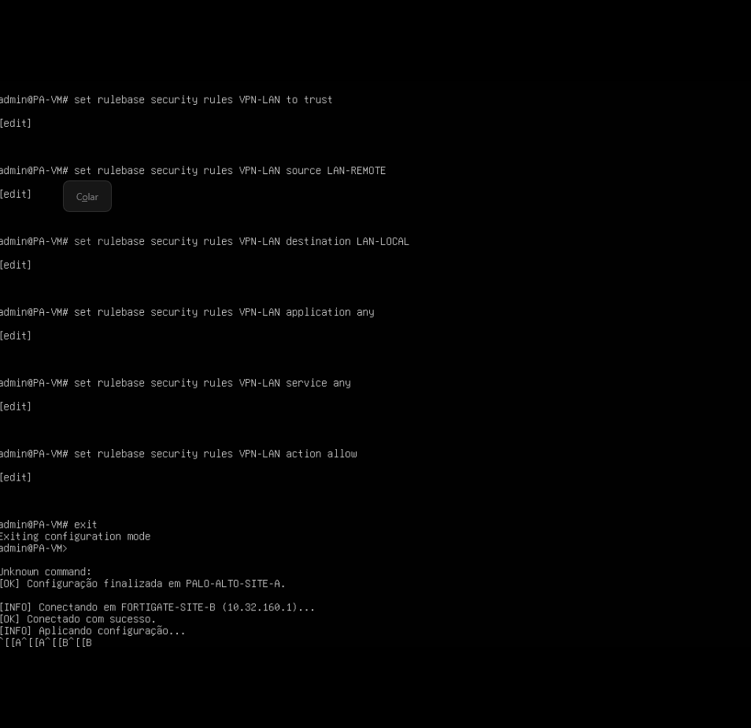
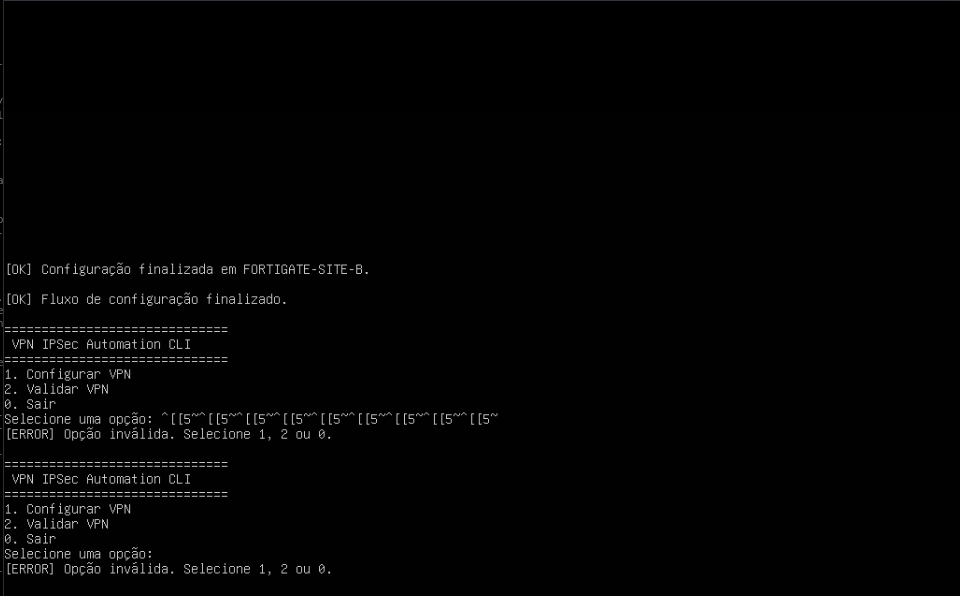

# LAB Opcional
## Considerações pessoais

Para a execução deste laboratório, foi necessária a aquisição de um plano EVE-NG Cloud, já que rodar as máquinas virtuais do FortiGate, Palo Alto e Ubuntu simultaneamente ultrapassava os limites de hardware da minha máquina. Apesar disso, consegui emular o ambiente o cenário proposto parcialmente, aproximando a topologia de um cenário real.

O código dessa automação se encontra em [app](/app/)


No desenvolvimento da automação, optei por implementar uma interface em linha de comando (CLI). Considerei que o tempo seria mais bem aproveitado focando na documentação, no planejamento e nos testes — etapas que, a meu ver, são as mais críticas desta avaliação.

Por fim, mesmo recorrendo a documentações, pesquisas e ferramentas de IA, priorizei entregar uma solução cujo funcionamento eu compreendesse, em vez de apresentar um produto visualmente legal, mas que estivesse além do conhecimento que consegui consolidar no prazo do desafio.

# Implementação do laboratório

Após a montagem da infraestrutura virtual, foram realizadas as seguintes etapas para preparação do ambiente:

1. Configuração do Ubuntu 24.04

O Ubuntu foi utilizado como estação responsável pela execução da automação já que estou emulando na nuvem.

As atividades realizadas foram:

- Configuração da interface de ens4 com o endereço 10.32.160.10/24;
- Instalação do Git;
- Instalação do Python 3;
- Clonagem do repositório utilizando git clone, permitindo acesso aos códigos do projeto.

```bash
sudo ip addr add 10.32.160.10/24 dev ens4
sudo apt update
sudo apt install python3
sudo apt install git -y
```

2. Configuração do Palo Alto

Inicialmente foi necessário configurar a interface de gerenciamento para utilizar endereço IP estático e habilitar o acesso remoto via SSH.

```
delete deviceconfig system type dhcp-client
set deviceconfig system type static
commit
```

Configuração dos parâmetros de gerenciamento:

```
configure
set deviceconfig system ip-address 10.32.160.2
set deviceconfig system netmask 255.255.255.0
set deviceconfig system default-gateway 10.32.160.10
set deviceconfig system dns-setting servers primary 8.8.8.8
commit
```

Criação/configuração do usuário utilizado pela automação:

```bash
set mgt-config users risperi password
```


3. Configuração do FortiGate

No FortiGate, o primeiro passo foi remover a configuração de DHCP da interface de gerenciamento, definir um endereço IP estático e habilitar os serviços necessários para administração remota.

```bash
config system interface
edit port1
set mode static
set ip 10.32.160.1 255.255.255.0
set allowaccess ping ssh
end
```

Em seguida, foi configurado o mesmo usuário utilizado no Palo Alto. A escolha teve como objetivo simplificar a autenticação durante o desenvolvimento e validação do laboratório. Em um ambiente de produção, o ideal seria utilizar RADIUS ou TACACS, além de credenciais específicas para as automações.

```bash
config system admin
edit admin
set password <senha>
end
```

Após a conclusão dessas configurações, foi realizada a validação do acesso SSH tanto ao FortiGate quanto ao Palo Alto, confirmando que ambos estavam aptos para serem utilizados pela automação desenvolvida.


## Observação sobre o estado do lab
Apesar da aplicação ter sido desenvolvida e o fluxo de automação estar funcional, o laboratório não foi concluído 100% devido a limitações encontradas nas imagens disponíveis para teste.

As imagens utilizadas apresentaram diferenças relevantes de versão e suporte de recursos. Em especial, a imagem FortiOS disponível aceitava apenas parâmetros criptográficos muito antigos para Phase 1 (DES), enquanto esses mesmos parâmetros não estavam mais disponíveis ou recomendados no Palo Alto utilizado no lab. Essa divergência impediu a validação completa do túnel IPSec fim a fim dentro do prazo disponível.

Como o prazo de entrega do desafio chegou, optei por manter o lab como uma prova de conceito funcional da arquitetura de automação, documentando as limitações encontradas. A aplicação demonstra a lógica proposta: leitura de parâmetros, validação de vendor, mapeamento por plataforma, geração de comandos e aplicação via SSH.

Após a entrega, continuarei estudando e buscando imagens de FortiGate e Palo Alto com versões mais compatíveis para concluir a validação ponta a ponta e fazer o túnel IPSec operar 100% em laboratório pois virou pessoal.

## Resumo


## Como executar o lab opcional no Ubuntu 24.04

Durante os testes no Ubuntu 24.04, foi necessário criar um ambiente virtual Python para instalar e utilizar o Netmiko corretamente.

### 1. Criar o ambiente virtual

Na pasta do projeto, execute:

```bash
sudo apt update
python3 -m venv netmiko
. netmiko/bin/activate
pip install netmiko
```

Após, acessar o diretorio parte\ 2/app e executar o arquivo ```main.py```


A aplicação foi construída em modo CLI, sem interface gráfica, para manter o fluxo simples, direto e adequado a um ambiente de laboratório. O programa apresenta um menu com opções para configurar a VPN ou executar comandos de validação.

```text
1. Configurar VPN
2. Validar VPN
0. Sair
```



A automação lê um arquivo JSON contendo os parâmetros da VPN [vpn.json](/parte%202/app/vpn.json), valida as informações obrigatórias, identifica o vendor de cada dispositivo, traduz os parâmetros para a sintaxe esperada por cada plataforma e gera os comandos necessários para FortiGate e Palo Alto. Em seguida, a aplicação pode conectar nos equipamentos via SSH utilizando Netmiko e aplicar a configuração.






## Fluxo principal

1. Exibir menu CLI.
2. Ler o arquivo JSON com os parâmetros da VPN.
3. Validar campos obrigatórios.
4. Validar se o vendor informado é suportado.
5. Mapear os parâmetros genéricos para a sintaxe correta de cada vendor.
6. Gerar comandos específicos para FortiGate ou Palo Alto.
7. Exibir os comandos no terminal, mascarando informações sensíveis como PSK.
8. Solicitar confirmação antes de aplicar a configuração.
9. Solicitar usuário e senha SSH em tempo de execução.
10. Conectar ao equipamento via Netmiko.
11. Aplicar a configuração.
12. Executar commit no Palo Alto, quando aplicável.
13. Permitir execução de comandos de validação pelo menu.

---

## Estrutura dos módulos

| Módulo | Função principal |
|---|---|
| `main.py` | Ponto de entrada da aplicação. Exibe o menu CLI, controla o fluxo de configuração/validação, solicita credenciais SSH e chama os demais módulos. |
| `loader.py` | Lê o arquivo JSON com os parâmetros da VPN e retorna os dados para a aplicação. |
| `vendors.py` | Mantém a lista de vendors suportados e valida se o vendor informado no JSON é aceito. |
| `parametros.py` | Mapeia parâmetros genéricos do JSON para a sintaxe específica de cada vendor, como FortiOS ou PAN-OS. |
| `conn.py` | Gerencia conexões SSH via Netmiko, aplica comandos, executa commit no Palo Alto, roda validações e trata erros de conexão. |
| `vendors/paloalto.py` | Gera comandos de configuração e validação específicos para Palo Alto/PAN-OS. |
| `vendors/fortigate.py` | Gera comandos de configuração e validação específicos para FortiGate/FortiOS. |

## Pontos de melhoria contínua

- **Frontend:** facilitar o uso por usuários sem familiaridade com JSON ou linha de comando.
- **Rollback automático:** restaurar a configuração anterior em caso de falha parcial durante a aplicação.
- **Integração com secret manager:** armazenar senhas e PSKs com segurança.
- **Validação avançada:** verificar compatibilidade de algoritmos, subnets, interfaces e vendors antes da execução.
- **Relatórios de execução:** gerar saída com comandos aplicados, validações e resultado final.
- **Suporte a múltiplos túneis:** permitir criação em lote de VPNs.
